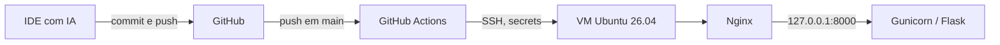

# Projeto Aplicado: Práticas de Mercado

Otavio Augustus Cavalcante da Silva  
Pós-graduação em Segurança da Informação, UNCISAL  
Disciplina: Projeto Aplicado: Práticas de Mercado

Repositório público do protótipo: login, uma página interna e logout, com o que o [escopo da disciplina](https://github.com/ziraldocardoso/Projeto_aplicado-praticas_de_mercado/blob/main/Escopo_e_elementos_obrigatorios.md) pede em volta disso. A VM na AWS ainda não foi criada. O IP público e os prints de TLS ficam marcados no fim deste texto para eu preencher depois do deploy.

O desenvolvimento foi feito num IDE com assistência de IA (Cursor, no papel do Antigravity indicado no escopo). Usei a IA para escrever e revisar o código. O que está aqui é o que o escopo pede, conferido com teste automatizado neste repositório.

## O que sobe

Uma aplicação Flask pequena, atrás do Gunicorn, atrás do Nginx. Não tem banco. Existe um usuário de demonstração. A senha não fica no código: o `scripts/init_env.py` gera um hash bcrypt e uma chave aleatória no `.env`, e o `.env` está no `.gitignore`.

Escolhi Flask em vez de uma página estática porque o corte de acesso precisa acontecer no servidor. O cookie carrega só um identificador. A decisão de mostrar `/interno` está em `exigir_autenticacao`, em `app.py`.

## Arquitetura e fluxo



No dia a dia o caminho é este:

1. Escrevo no IDE com IA e faço commit.
2. O `git push` para `main` dispara `.github/workflows/deploy.yml`.
3. O job `testar` roda `pytest`. Se falhar, a VM não é tocada.
4. O job `publicar` abre SSH com `VM_HOST`, `VM_USER`, `VM_SSH_KEY` e `VM_SSH_KNOWN_HOSTS`. Não há senha nem IP fixo no YAML.
5. Na VM, `infra/remote-deploy.sh` atualiza o clone em `/opt/projeto-aplicado`, instala o `requirements.txt` e reinicia o `projeto-aplicado.service`.
6. O Nginx é o único processo exposto. Ele redireciona HTTP para HTTPS e faz proxy para o Gunicorn em `127.0.0.1:8000`. O Gunicorn não escuta na rede da instância.

A sessão e o contador de tentativas de login ficam na memória de um único worker (`gunicorn.conf.py`). Reiniciar o serviço desloga todo mundo. Para este protótipo isso é aceitável e evita um banco só para guardar sessão. Dois workers perderiam o login entre um processo e outro.

## Como rodar na minha máquina

Python 3.12 ou mais novo.

```bash
python3 -m venv .venv
source .venv/bin/activate
pip install -r requirements.txt
python scripts/init_env.py
python app.py
```

Abro `http://127.0.0.1:8000/`, entro com o usuário e a senha que o script pediu, vejo a área interna e uso Sair. O cookie local não leva a flag Secure, porque a página está em HTTP. Atrás do Nginx com HTTPS ela passa a ser Secure: o Gunicorn só acredita em `X-Forwarded-Proto` quando o pedido veio de `127.0.0.1`.

Não faço `source .env`. O hash bcrypt contém `$`, e o bash trata isso como variável. O `python app.py` lê o arquivo pelo `python-dotenv`, que não faz essa expansão. Na VM quem lê o arquivo é o systemd, que também não expande `$` dentro de `EnvironmentFile`.

Testes:

```bash
pip install -r requirements-dev.txt
pytest
```

Os testes sobem a aplicação com um hash de custo baixo, só no processo do pytest. O `init_env.py` usa o custo padrão do bcrypt, que hoje é 12.

## Secrets do GitHub

Settings → Secrets and variables → Actions. Nenhum destes valores aparece no repositório.

| Secret | O que é |
| --- | --- |
| `VM_HOST` | IP público da VM, sem esquema e sem barra |
| `VM_USER` | `ubuntu`, o usuário da AMI da Canonical |
| `VM_SSH_KEY` | chave privada do deploy, o arquivo inteiro, incluindo as linhas de começo e fim |
| `VM_SSH_KNOWN_HOSTS` | saída de `ssh-keyscan IP_PUBLICO`, colada como está |

A chave pública correspondente vai para `/home/ubuntu/.ssh/authorized_keys`. O workflow usa `StrictHostKeyChecking=yes`. Sem o `VM_SSH_KNOWN_HOSTS` ele para, em vez de aceitar qualquer host na primeira conexão.

## VM: Ubuntu 26.04 LTS

A disciplina deixa Ubuntu ou Debian estáveis. Para o teste de PQC da DigiCert eu preciso de `X25519MLKEM768` no TLS 1.3. Isso entrou no OpenSSL 3.5. Conferi o que cada Ubuntu entrega:

- **Ubuntu 26.04 LTS** traz OpenSSL 3.5.5 e Nginx 1.28.2. O Nginx do sistema já está ligado a esse OpenSSL. Com `ssl_ecdh_curve X25519MLKEM768:X25519:secp384r1:prime256v1` o servidor oferece o grupo híbrido e ainda fala com cliente que só tem X25519. É a imagem que vou usar.
- Ubuntu 24.04 LTS traz OpenSSL 3.0.13. O mesmo `ssl_ecdh_curve` faz o `nginx -t` falhar, porque o grupo não existe. A própria Ubuntu registrou que não pretende fazer backport desses grupos para o 24.04. Dá para compilar Nginx contra OpenSSL 3.5, ou carregar o `oqs-provider`, mas isso é outra pilha de software numa VM pequena. Não segui por aí.
- 25.04 e 25.10 também têm o grupo, e não são LTS. Em setembro de 2026 o LTS vigente com PQC nativo é o 26.04.

Na AWS: AMI **Ubuntu Server 26.04 LTS** (64-bit x86, Canonical), instância `t3.micro`, disco gp3 de 20 GB. Região à escolha; `sa-east-1` é a que fica mais perto. O free tier da conta é que diz se o tipo entra no crédito. Não crio access key de IAM na instância: o deploy usa SSH, não a API da AWS.

O passo a passo com os comandos está em [`infra/PROVISIONAMENTO.md`](infra/PROVISIONAMENTO.md). Resumo, na ordem:

1. Security group: 80 e 443 para a internet; 22 só para o meu IP `/32`. Depois, as faixas de IP do GitHub Actions na porta 22, senão o workflow não entra. A lista pública está em `https://api.github.com/meta`, campo `actions`.
2. SSH com a chave, usuário `ubuntu`.
3. `sudo ADMIN_CIDR=MEU_IP/32 bash .../infra/provision.sh`, a partir de um clone. O script instala Nginx, Fail2Ban, UFW e Certbot, e recusa ligar o firewall se o `ADMIN_CIDR` não for o IP da sessão SSH atual.
4. `sudo python3 /opt/projeto-aplicado/scripts/init_env.py` e `sudo systemctl start projeto-aplicado`.
5. `sudo /opt/projeto-aplicado/infra/enable-https.sh --ip IP_PUBLICO --email meu-email`. Sem `--staging`.

O que cada arquivo de infra faz:

| Arquivo | Onde vai parar na VM |
| --- | --- |
| `infra/nginx/projeto-aplicado.conf` | site HTTPS, redirect e proxy |
| `infra/nginx/projeto-aplicado-http.conf` | site temporário, só até o certificado existir |
| `infra/fail2ban/jail.d-sshd.local` | `/etc/fail2ban/jail.d/zz-sshd.local` |
| `infra/ssh/99-hardening.conf` | `/etc/ssh/sshd_config.d/99-hardening.conf` |
| `infra/systemd/projeto-aplicado.service` | unidade do Gunicorn |
| `infra/provision.sh` | pacotes, firewall, SSH, Fail2Ban |
| `infra/enable-https.sh` | Certbot e troca para o site HTTPS |
| `infra/remote-deploy.sh` | o que o Actions executa |

### SSH, firewall e Fail2Ban

`infra/ssh/99-hardening.conf` desliga senha (`PasswordAuthentication no`), exige `AuthenticationMethods publickey`, recusa login de root e limita a 4 tentativas por conexão. No Ubuntu o `Include` do `sshd_config.d` vem antes do resto do arquivo, e o OpenSSH fica com o primeiro valor que encontra. Por isso o drop-in ganha do `PasswordAuthentication yes` que a imagem às vezes ainda traz. Confiro com `sshd -T`.

O UFW nega entrada, libera 80 e 443, e libera 22 só a partir do `ADMIN_CIDR`. O security group repete essa ideia na borda da AWS. Os dois precisam concordar: se o grupo deixa a porta fechada, o UFW não tem o que filtrar.

Fail2Ban, jail `sshd`, arquivo `infra/fail2ban/jail.d-sshd.local`:

- `maxretry = 4`
- `bantime = 24h`
- `findtime = 10m`
- `backend = systemd`, porque o sshd do Ubuntu atual grava no journal

Quatro falhas em dez minutos banem o IP por 24 horas. Localhost fica de fora (`ignoreip`).

### Certificado de IP e TLS

A Let's Encrypt emite certificado para endereço IP desde janeiro de 2026, e ele tem de ser do perfil `shortlived` (cerca de 6 dias). O Certbot ganhou `--ip-address` na 5.3 e o suporte disso no plugin `webroot` na 5.4. O plugin do Nginx ainda não instala certificado de IP, então o script pede o certificado com `certonly` e o Nginx aponta para os arquivos em `/etc/letsencrypt/live/`.

Comando, também dentro de `infra/enable-https.sh`:

```bash
sudo /opt/certbot/bin/certbot certonly \
  --non-interactive --agree-tos --no-eff-email \
  --email meu-email@exemplo.com \
  --preferred-profile shortlived \
  --key-type ecdsa --elliptic-curve secp256r1 \
  --webroot --webroot-path /var/www/html \
  --ip-address IP_PUBLICO \
  --deploy-hook /usr/local/sbin/reload-nginx-cert.sh
```

Não uso `--staging` na emissão final. O staging existe para eu errar sem bater no limite da CA; o certificado dele não é confiado, e o ssl.org não marcaria Certificate Trusted: YES.

Renovação automática: o pip do Certbot não cria timer. O script acrescenta em `/etc/crontab` a linha recomendada pela EFF, duas vezes por dia, com uma espera aleatória de até uma hora antes do `certbot renew -q`. Certificado de 6 dias precisa dessa frequência. O `--deploy-hook` e o script em `/etc/letsencrypt/renewal-hooks/deploy/reload-nginx.sh` recarregam o Nginx só quando a emissão ou a renovação de fato grava certificado novo.

O Nginx de produção (`infra/nginx/projeto-aplicado.conf`):

- porta 80 redireciona para HTTPS, exceto `/.well-known/acme-challenge/`, que continua em `/var/www/html` para a renovação;
- TLS 1.2 e 1.3 apenas, cifras ECDHE com AES-GCM e ChaCha20, sem DHE (evita grupo DH fraco);
- `ssl_ecdh_curve X25519MLKEM768:X25519:secp384r1:prime256v1;`
- cadeia completa em `fullchain.pem`, grampeamento OCSP com `chain.pem`;
- HSTS de um ano, sem `preload` (preload é lista de domínio, e aqui o nome é um IP);
- `server_tokens off`.

A chave do certificado é ECDSA P-256 (`secp256r1`), assinada com SHA-256 pela Let's Encrypt. É o par que os checkers costumam descrever como assinatura boa e chave de tamanho aceitável, e a cadeia pública é o que produz Certificate Trusted: YES. Se o ssl.org rotular a chave de outro jeito, o `enable-https.sh` é o lugar para trocar `--key-type` e emitir de novo; o restante da configuração não depende disso.

No servidor, a prova local do PQC é o `openssl s_client` com `-groups X25519MLKEM768` citando esse grupo na negociação, e `openssl version` em 3.5 ou mais novo. O print oficial é o checker da DigiCert, no fim deste relatório.

Para um domínio, o SSL Labs pede nota A. Esta entrega usa IP, então o checker pedido é o ssl.org, não o SSL Labs. A configuração acima é a mesma que eu usaria para buscar essa nota: TLS 1.0 e 1.1 desligados, só sigilo de encaminhamento, cadeia completa, HSTS. Não tenho domínio para mostrar a nota.

## Checklist do escopo

- [ ] Aplicação no ar num IP público. A VM ainda não existe.
- [ ] Nginx com HTTPS, Certbot e redirect HTTP → HTTPS. Os arquivos estão no repositório; a emissão depende da VM.
- [ ] ssl.org com Certificate Trusted: YES e Good signature · Acceptable key, e DigiCert com PQC. Falta o print.
- [x] SSH só por chave, Fail2Ban com 4 tentativas e ban de 24 horas, portas 80 e 443 abertas e 22 restrita. Configuração em `infra/`.
- [x] Repositório público no GitHub.
- [x] `.gitignore` cobre `.env`, chave, `venv`, banco local. Não há segredo commitado.
- [x] Login, página interna e logout, escritos com IDE assistido por IA.
- [x] Este README aponta as categorias OWASP e o trecho de código.
- [x] GitHub Actions em push para `main`, deploy por SSH usando secrets.

## OWASP Top 10:2025

A lista vigente, em [owasp.org/Top10/2025](https://owasp.org/Top10/2025/), é:

1. A01:2025 Broken Access Control
2. A02:2025 Security Misconfiguration
3. A03:2025 Software Supply Chain Failures
4. A04:2025 Cryptographic Failures
5. A05:2025 Injection
6. A06:2025 Insecure Design
7. A07:2025 Authentication Failures
8. A08:2025 Software or Data Integrity Failures
9. A09:2025 Security Logging and Alerting Failures
10. A10:2025 Mishandling of Exceptional Conditions

A disciplina pede três. O login acabou encostando em mais do que três, e eu documento o que o código realmente faz. Se a correção quiser só três nomes, os centrais são **A01, A07 e A04**.

### A01:2025 Broken Access Control

`/interno` e `POST /sair` passam por `exigir_autenticacao` em `app.py`. O decorador chama `obter_sessao`, que procura o cookie `sid` num dicionário do processo. Sessão ausente, desconhecida ou vencida responde com redirect para `/login`. O HTML da área interna não vai na resposta.

O cookie não é a sessão. Ele é um `token_urlsafe` de 32 bytes. Dá para ler o valor no navegador e mesmo assim não há nome de usuário nem flag de “logado” dentro dele. Apagar o registro no servidor, em `apagar_sessao`, invalida o cookie na hora. O teste `test_cookie_antigo_nao_entra_depois_do_logout` manda o identificador velho de volta e recebe redirect.

Não existe parâmetro `next`. O destino depois do login é fixo, `url_for("interno")`, então não há redirect aberto. O logout é POST, com o mesmo token CSRF da sessão, para um `` ou um link não deslogar a pessoa.

### A07:2025 Authentication Failures

Um usuário só, vindo de `DEMO_USERNAME`. A senha digitada é conferida com `bcrypt.checkpw` em `credencial_aceita`. Se o nome não bate, a comparação de senha roda contra um hash falso, gerado na subida com o mesmo custo do hash real, para o tempo de resposta não entregar se o usuário existe. A mensagem é a mesma nos dois casos: "Usuário ou senha inválidos." Senha vazia ou com mais de 72 bytes é recusada; o bcrypt truncaria em silêncio, e isso eu não quero.

`registrar_falha` e `bloqueado` contam falhas por IP, no máximo 5 em 15 minutos (`LIMITE_FALHAS`, `JANELA_FALHAS_SEGUNDOS`). A sexta tentativa recebe 429 e `Retry-After`, mesmo que a senha esteja certa. Outro IP não herda o bloqueio. O IP usado é o `X-Real-IP` que o Nginx grava com `$remote_addr`. O Gunicorn só escuta em localhost, então um cliente de fora não falsifica esse cabeçalho.

Depois da senha certa o identificador da sessão anônima é apagado e outro é emitido. Isso corta fixação de sessão: quem plantou o cookie de antes do login não fica autenticado. O teste `test_sessao_muda_depois_do_login` cobre a troca.

O formulário leva `csrf_token` guardado na sessão do servidor e comparado com `hmac.compare_digest`. POST sem token, ou com `Origin` de outro host, não autentica.

### A04:2025 Cryptographic Failures

A senha não é armazenada. `scripts/init_env.py` grava o hash bcrypt e uma `SECRET_KEY` de `secrets.token_urlsafe`. O `.env.example` tem placeholder. Se alguém copiar o exemplo sem preencher, `criar_app` recusa subir.

`gravar_cookie` marca o cookie como `HttpOnly`, `SameSite=Strict` e `Secure` quando a conexão, vista pelo proxy, é HTTPS. `HttpOnly` tira o identificador do JavaScript. `SameSite=Strict` não manda o cookie num POST vindo de outro site. A sessão autenticada dura 8 horas no servidor; o `Max-Age` do cookie acompanha.

O TLS fica no Nginx, não no Flask. A seção anterior descreve o perfil `shortlived`, a cadeia completa e o grupo híbrido `X25519MLKEM768`.

### A02:2025 Security Misconfiguration

`criar_app` força `DEBUG = False` e `PROPAGATE_EXCEPTIONS = False`. O `python app.py` também sobe com `debug=False`. Cabeçalhos em `adicionar_cabecalhos`: CSP, `X-Content-Type-Options: nosniff`, `X-Frame-Options: DENY`, `Referrer-Policy: no-referrer`, `Permissions-Policy` fechando câmera, microfone e geolocalização, `Cache-Control: no-store`. O Nginx repete CSP, frame, nosniff e acrescenta HSTS. `server_tokens off` tira a versão do Nginx. O Gunicorn não publica socket de controle e não escuta fora de `127.0.0.1`.

A unidade systemd roda como `www-data`, com `NoNewPrivileges`, `ProtectSystem=strict`, `ProtectHome` e `PrivateTmp`. O `.env` é lido pelo systemd como root; o processo não precisa de permissão de leitura no arquivo.

SSH sem senha, UFW e o security group estão na seção da VM. Nada disso é "default de imagem de nuvem deixado como veio".

### A05:2025 Injection

Não há SQL nem chamada de shell com dado do formulário. O que daria para injetar aqui é HTML. Os templates são Jinja com autoescape, não uso `|safe`, e a mensagem de erro do login é texto fixo: o nome enviado não volta na página. `test_nao_reflete_html_do_login` manda uma tag de script e procura essa tag na resposta. `test_template_interno_escapa_html` renderiza o template interno com `<script>` e espera `&lt;script&gt;`.

A CSP é `script-src 'none'`. A página não tem JavaScript. O mesmo texto está em `app.py` (`POLITICA_CSP`) e no Nginx; um teste compara os dois, porque cabeçalho duplicado com políticas diferentes quebra a página.

`texto_log` tira CR e LF do que vai para o journal, para uma entrada de log não forjar a linha de baixo.

### A09:2025 Security Logging and Alerting Failures

`login_ok`, `login_falha`, `login_bloqueio`, `login_csrf_invalido` e `logout` vão para o logger da aplicação, que o systemd joga no journal. A senha e o identificador de sessão não entram na linha. `test_log_de_falha_nao_guarda_a_senha` lê o log do ensaio e procura a senha usada.

Na VM:

```bash
journalctl -u projeto-aplicado -f
```

Isso é registro, não um alerta que me acorda. O alerta automático desta entrega é o Fail2Ban na porta 22. Eu não monto um SIEM para um protótipo de uma tela.

### A10:2025 Mishandling of Exceptional Conditions

`erro_nao_tratado` devolve uma página genérica e manda o traceback só para o log. `test_erro_interno_nao_devolve_o_detalhe` força um `RuntimeError` com um texto conhecido e confirma que esse texto não sai na resposta. 404, 405 e 413 também caem em `erro.html`, sem a página padrão do framework.

`MAX_CONTENT_LENGTH` recusa corpo maior que 16 KB. Os dicionários de sessão e de falha têm teto (`LIMITE_SETORES`), para um volume de IPs não crescer sem limite na memória da VM. `bcrypt.checkpw` com hash quebrado vira falha de login, não erro 500. Configuração ausente ou placeholder derruba o processo na subida, em vez de autenticar com um valor de exemplo.

### Controles que ficam ao lado, sem eu contar como categoria principal

As dependências diretas estão pinadas em `requirements.txt`. O workflow usa `actions/checkout` e `actions/setup-python` presos no commit, e o deploy é OpenSSH do runner, sem action de terceiro. Não há script de CDN na página. Isso conversa com A03 (Software Supply Chain Failures), e eu não tenho um scanner de CVE rodando, então não vou marcar a categoria como resolvida.

O `git reset --hard origin/main` e a verificação da chave de host do SSH conversam com A08 (Software or Data Integrity Failures): o que sobe na VM é o commit que o GitHub entregou, e o runner não aceita um host que ele acabou de conhecer na rede.

## Evidências depois do deploy

IP público da VM: `PREENCHER_APOS_O_DEPLOY`  
URL: `https://PREENCHER_APOS_O_DEPLOY/`

Print do [SSL.org](https://www.ssl.org/) (Certificate Trusted: YES e Algorithm / Key Type & Size: Good signature · Acceptable key):

`docs/evidencias/ssl-org.png` — ainda não anexado.

Print do [DigiCert PQC checker](https://www.digicert.com/pqc-checker) com troca de chaves `X25519MLKEM768`:

`docs/evidencias/digicert-pqc.png` — ainda não anexado.

O que esperar em cada um, e o comando local equivalente, estão em [`infra/PROVISIONAMENTO.md`](infra/PROVISIONAMENTO.md).

## Referências

- Escopo da disciplina: https://github.com/ziraldocardoso/Projeto_aplicado-praticas_de_mercado/blob/main/Escopo_e_elementos_obrigatorios.md
- OWASP Top 10:2025: https://owasp.org/Top10/2025/
- Let's Encrypt, certificados de 6 dias e de IP: https://letsencrypt.org/2026/01/15/6day-and-ip-general-availability.html
- Certbot 5.4 e `--ip-address`: https://letsencrypt.org/2026/03/11/shorter-certs-certbot
- EFF, o mesmo anúncio: https://www.eff.org/deeplinks/2026/03/certbot-and-lets-encrypt-now-support-ip-address-certificates
- Ubuntu 26.04 e criptografia: https://ubuntu.com/blog/ubuntu-26-04-lts-security-updates
- Checker de certificado: https://www.ssl.org/
- Checker de PQC: https://www.digicert.com/pqc-checker
